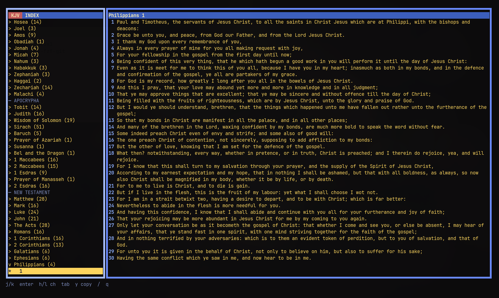

# kjv-tui

King James Bible reader for the terminal. Index on the left, full chapter on the right.

This is **not** [kjv-fzf](https://aur.archlinux.org/packages/kjv-fzf-git), the old fzf verse finder.



Built for [Omarchy](https://omarchy.org/). It is a TUI app, not an Omarchy shell plugin.

The embedded text is the public-domain KJV (with Apocrypha) from [LukeSmithxyz/kjv](https://github.com/LukeSmithxyz/kjv).

## Install on Arch / Omarchy

From this repo:

```bash
git clone https://github.com/Caleb-parrot/kjv.git
cd kjv
makepkg -si
```

That installs `/usr/bin/kjv-tui` and a Super+Space launcher named **KJV**.

If you already have Go and do not want a package:

```bash
omarchy install dev-env go
git clone https://github.com/Caleb-parrot/kjv.git
cd kjv
go build -o ~/.local/bin/kjv-tui .
omarchy tui install KJV ~/.local/bin/kjv-tui tile accessories-dictionary
```

Optional Super-menu row — add this to `~/.config/omarchy/extensions/omarchy-menu.jsonc`:

```jsonc
"kjv": {
  "icon": "",
  "label": "KJV",
  "description": "King James Bible",
  "action": "omarchy-launch-or-focus-tui --app-id=TUI.tile kjv-tui"
}
```

## Keys

| Key | Action |
| --- | --- |
| `j` / `k` | Move in the index, or scroll the chapter |
| `enter` | Open or close a book, or focus the chapter |
| `h` / `l` or `n` / `p` | Previous / next chapter |
| `tab` | Switch panes |
| `y` | Copy the chapter |
| `/` | Filter books and chapters |
| `q` | Quit (remembers your place) |

## CLI

```bash
kjv-tui              # TUI
kjv-tui -l           # list books
kjv-tui John 3       # print a chapter
kjv-tui Phi 1        # abbreviations work
```

## License

Code is Unlicense. The KJV text is public domain.
